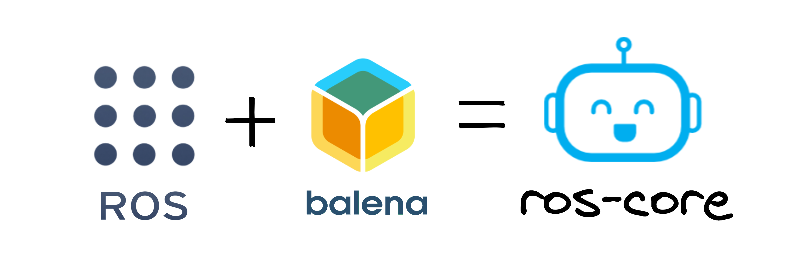

# ros-core
### A full installation of ROS Noetic inside a block. 

## Background
### What is ROS? 
#### ROS: stands for Robotic Operating System. It is a framework for developing robotics applications. 

### Why run ros within balena?
#### Running ros within balena reduces the complexity of the setup and makes it easier to use. Historically setting up ubuntu and installing ROS was a bit of a hassle. And when it comes to setting up more than a few robots and managing a fleet of robots in the field this can be a major headache.
#### Here's where `balena` comes in. By having ROS balenifyed it allows your to not worry about setup, its as easy as creating a docker file! And pushing and managing changes is easier than ever!

# Technical Details

One instance of this image required to run anything ROS-related on balena devices. Instead of a having full copy of ROS for each service, we define a volume mount share and let the other ROS blocks access the same binaries. 

It's main functionality however is to run the`roscore` process. This process keeps track of the nodes that are running, how to reach them, and what their message types are.

Additionally, ROSCore makes it possible that ROS nodes can all to talk to each other even if they are part of different services/containers. For security reasons, there's a separate internal network for the services. However, you can open whatever port you want to the external world.

# Easy Deployment
Use this as standalone with the button below:
[](https://dashboard.balena-cloud.com/deploy?repoUrl=https://github.com/cristidragomir97/ros-core)


## ROS networking

##### 1. Set environment variables for ROSCore container

For multi-machine setups, or multi-container in our case, ROS requires two environment variables to be set, one is `ROS_HOSTNAME`, which is the hostname of the service in question. Since docker engine allows services get resolved by their name, you need to set it to your service name. `ROS_MASTER_URI` is basically the hostname of the machine/service that runs roscore.

##### 2. Add links

After `ROS_MASTER_URI` has been set, services will able to send messages to the core process, but the reverse it's not true, core has no way to know where to send the callback. To solve this issue we need to set links to help resolve them.

Here is an example of a `docker-compose.yaml` file :

```yaml
version: "2.1"

volumes:
  shered-ros-bin:

services:
  - roscore:
        image: cristidragomir97/ros-core
        environment:
            - ROS_HOSTNAME=roscore
            - ROS_MASTER_URI=http://roscore:11311
        links:
            - service0
            - service1
        volumes:
          - shered-ros-bin:/opt/ros/noetic

  - service0:
        build: ./service0
        environment: 
            - ROS_HOSTNAME=service0
            - ROS_MASTER_URI=http://roscore:11311
        volumes:
          - shered-ros-bin:/opt/ros/noetic
  
  - service1:
        build: ./service1
        environment: 
            - ROS_HOSTNAME=service1
            - ROS_MASTER_URI=http://roscore:11311
        volumes:
          - shered-ros-bin:/opt/ros/noetic
```

  

##### 2. Set variables for ROSCore container

you need to set `ROS_HOSTNAME` and `ROS_MASTER_URI=http://roscore:11311` for each service. You can either define it in the `docker-compose.yml` or use the dashboard.

  
##### 3. (Optional) Expose ports to talk to the outside world


-----------------
# Contributors

[](https://github.com/cristidragomir97/ros-core/graphs/contributors)

##### Made with [contributors-img](https://contrib.rocks).

-----------------

# License

#### MIT © cristidragomir97 
[](https://opensource.org/licenses/MIT)


```bash
by cristidragomir97
github.com/cristidragomir97
2022/03/14
```